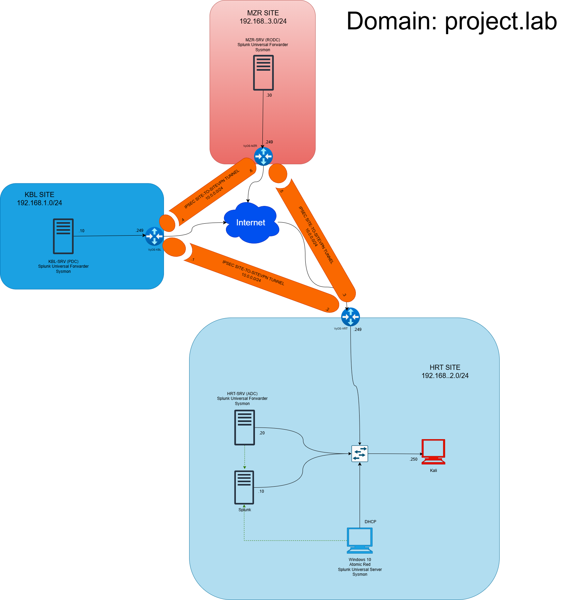
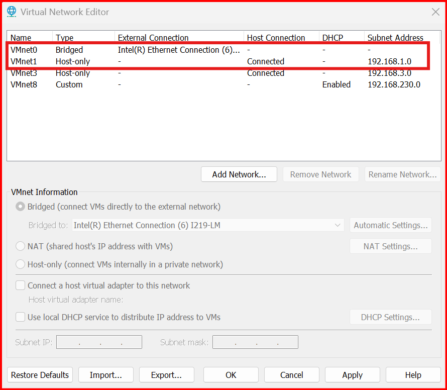
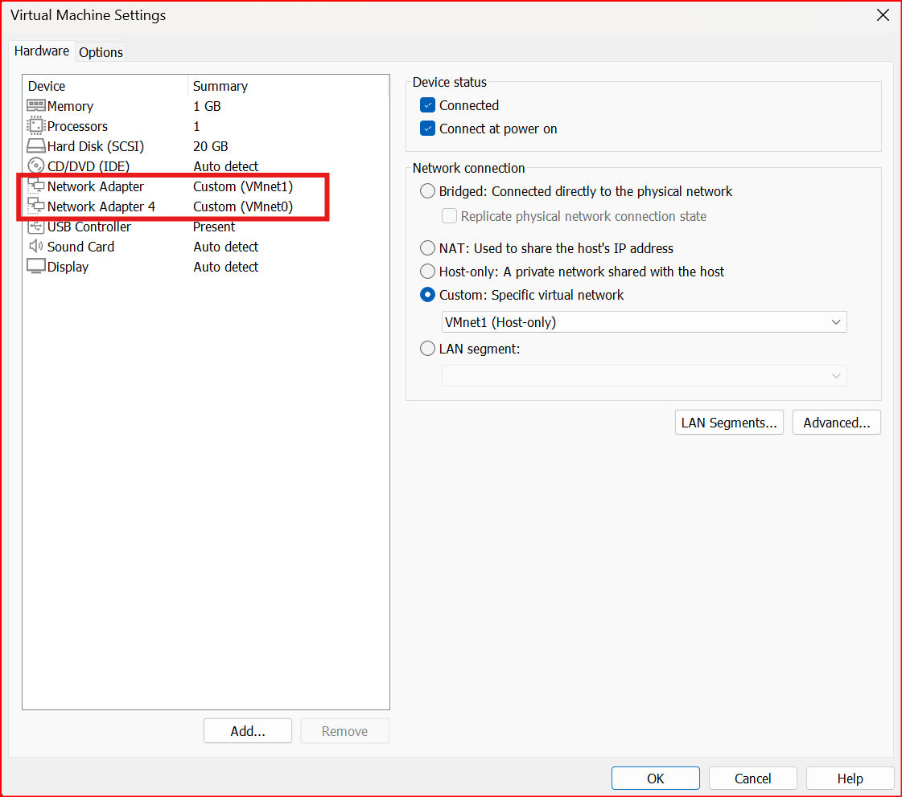
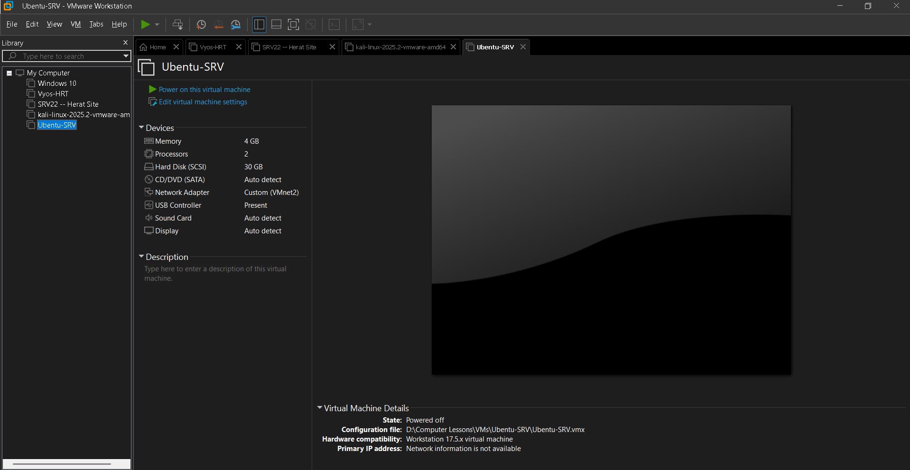

# Multisite Active Directory Collaborated Lab with IPsec VPN and Security Monitoring
Welcome to the multisite active directory lab with site-to-site VPN configuration and implemented security measures. This lab has been created in collaboration with [edris526](https://github.com/edris526).

This project simulates a realistic enterprise network environment across three geographically separated Active Directory (AD) sites, interconnected through IPSec VPN tunnels. It provides a platform for blue team monitoring and red team simulation, suitable for learning, research, and testing in cybersecurity and system administration.

# Project Overview

## 🌐 Domain: `project.lab`

### 🏢 Sites Overview

- **KBL SITE** (`192.168.1.0/24`)  
  - Server: `KBL-SRV`  
  - Roles: Splunk Universal Forwarder, Sysmon  
  - VPN Connection: IPSec Tunnel to MZR and HRT

- **HRT SITE** (`192.168.2.0/24`)  
  - Domain Controller: `HRT-SRV (ADC)`
      - Roles: Splunk Universal Forwarder, Sysmon 
  - Ubentu Server: Splunk Indexer  
  - Endpoints:
    - `Windows 10 Client`: Atomic Red Team
    - `Kali Linux`: Simulated attacker system  
  - VPN Connection: IPSec Tunnel to MZR and KBL

- **MZR SITE** (`192.168.3.0/24`)  
  - Server: `MZR-SRV`  
  - Roles: Splunk Universal Forwarder, Sysmon  
  - VPN Connection: IPSec Tunnel to KBL and HRT

---

## 🔐 Security & Monitoring Stack

- **IPSec Site-to-Site VPN**  
  Ensures secure and encrypted communication between the AD sites using virtual tunnel interfaces (VTIs).

- **Splunk Monitoring**
  - **Indexer** hosted at HRT
  - **Universal Forwarders** installed on all servers
  - **Sysmon** for endpoint visibility and Windows telemetry

- **Atomic Red Team (ART)**
  - Deployed at **HRT site** to simulate adversary behavior for security testing and detection engineering.

- **Red Team Simulation**
  - `Kali Linux` machine performs **brute-force attacks** on the Windows 10 system's **RDP service** using the **Hydra tool**.
  - Attack telemetry is collected and analyzed via Splunk.

---

## 🎯 Objectives

- Build a secure, isolated, and production-like multi-site AD infrastructure.
- Implement encrypted routing between sites using IPSec VPN.
- Gain hands-on experience with log aggregation and detection engineering using Splunk.
- Test endpoint detection and response (EDR) strategies with Sysmon and ART.
- Simulate real-world attacks and analyze their artifacts in a monitored environment.

---

## 📁 Tools & Technologies

- **VMware:** used for virtualization of network components (VyOS routers and end-hosts)
- **Windows Server 2019/2022**, **Windows 10**
- **Kali Linux**
- **Splunk Enterprise**, **Splunk Universal Forwarder**
- **Sysmon**
- **Atomic Red Team**
- **Hydra**
- **VyOS**

---

## 🧠 Ideal For:

- Students and professionals learning enterprise AD topology
- Blue teamers practicing log analysis and detection
- Red teamers testing adversary simulation in isolated labs
- SOC analysts refining Splunk dashboards and alerts

---

# Network Configuration

We are going to use VMware for the servers and routers virtualization. In this project, all routers and servers have been previously installed so you need to be able to install virtual machines such as Windows Server 2022 and VyOS routers by yourself. 

Each VyOS router needs at least two interfaces, one for the internal network (with a host-only VMnet) and another for WAN purposes (Using a VMnet with Bridge mode). In VMware go to `Edit` then click on `Vitual Network Editor`. You need to configure two VMnets (in this case, VMnet0 for Bridge adapter and VMnet1 for host-only). Then you have to go to your router's settings and add another Network adapter. Set each adapter to the correct VMnet. Do this for all routers. (the images below show VyOS-KBL's VMnet setup)

  
  

Now you can configure your router's interfaces. Use this command `set interfaces `
Configuring all three sites' network:

  
  
  

## 🔧 Step-by-Step Setup
2. Splunk Enterprise Setup:
   First downlaod splunk enterprise and ubentu server. I will host splunk enterprise on uebntu server. 
 1) Introduction to Splunk Enterprise:
 Splunk Enterprise is a widely adopted platform designed for collecting, indexing, and analyzing machine data in real time. It supports log ingestion from a wide range of sources and is commonly used in Security Operations Centers (SOCs) as a Security Information and Event Management (SIEM) solution. With its powerful search capabilities and rich visualizations, Splunk helps security teams detect threats, investigate incidents, and monitor system activity effectively.
2)my benefits from working on splunk on this lab.
Integrating Splunk Enterprise into my home lab environment has been a valuable step toward building practical cybersecurity skills. With this setup, I can continuously monitor system activity, detect suspicious behavior, and simulate real-world SOC operations. This hands-on approach not only strengthens my understanding of how modern security tools work but also improves my ability to respond to potential threats—an essential skillset for anyone pursuing a career in cybersecurity.
3) Downloading Splunk Enterprise (Free Trial):
Visit the Official [Splunk Website](https://www.splunk.com) log in or sign up. after logging in hover to Platrom and select free trials and Downalods. Select Splunk Enterprise Get My Free Trieal. Select your host operating system. Since meine is Ubentu server I  chose linux with .deb pacakge.

4) Downloading Ubuntu server:
 I downloaded the latest LTS version of Ubuntu from the [Ubuntu Downloads page](https://ubuntu.com/download/server). At the time of writing, the newest version available was Ubuntu 24.04.2 LTS, and the ISO file was approximately 3GB

5) Creating the Ubuntu VM:
With the ISO downloaded, I proceeded to create the Ubuntu VM on vmware workstation:

 

   
