Lab with IPsec VPN and Security Monitoring
Welcome to the multisite active directory lab with site-to-site VPN configuration and implemented security measures. This lab has been created in collaboration with [edris526](https://github.com/edris526).

This project simulates a realistic enterprise network environment across three geographically separated Active Directory (AD) sites, interconnected through IPSec VPN tunnels. It provides a platform for blue team monitoring and red team simulation, suitable for learning, research, and testing in cybersecurity and system administration.

---

## 📚 Table of Contents

1. [Project Overview](#project-overview)
2. [Network Configuration](#network-configuration)
3. [Site-to-Site IPsec VPN Configuration](#site-to-site-ipsec-vpn-configuration)
4. [AD DS Installation and Configuration](#ad-ds-installation-and-configuration)
5. [Security Monitoring & Adversary Emulation](#security-monitoring-and-adversary-emulation)

---

# Project Overview

## 🌐 Domain: `project.lab`

### 🏢 Sites Overview

- **KBL SITE** (`192.168.1.0/24`)  
  - Server: `KBL-SRV`  
  - Roles: Splunk Universal Forwarder, Sysmon  
  - VPN Connection: IPSec Tunnel to MZR and HRT

- **HRT SITE** (`192.168.2.0/24`)  
  - Domain Controller: `HRT-SRV (ADC)`
      - Roles: Splunk Universal Forwarder, Sysmon 
  - Ubentu Server: Splunk Indexer  
  - Endpoints:
    - `Windows 10 Client`: Atomic Red Team
    - `Kali Linux`: Simulated attacker system  
  - VPN Connection: IPSec Tunnel to MZR and KBL

- **MZR SITE** (`192.168.3.0/24`)  
  - Server: `MZR-SRV`  
  - Roles: Splunk Universal Forwarder, Sysmon  
  - VPN Connection: IPSec Tunnel to KBL and HRT

---

## 🔐 Security & Monitoring Stack

- **IPSec Site-to-Site VPN**  
  Ensures secure and encrypted communication between the AD sites using virtual tunnel interfaces (VTIs).

- **Splunk Monitoring**
  - **Indexer** hosted at HRT
  - **Universal Forwarders** installed on all servers
  - **Sysmon** for endpoint visibility and Windows telemetry

- **Atomic Red Team (ART)**
  - Deployed at **HRT site** to simulate adversary behavior for security testing and detection engineering.

- **Red Team Simulation**
  - `Kali Linux` machine performs **brute-force attacks** on the Windows 10 system's **RDP service** using the **Hydra tool**.
  - Attack telemetry is collected and analyzed via Splunk.

---

## 🎯 Objectives

- Build a secure, isolated, and production-like multi-site AD infrastructure.
- Implement encrypted routing between sites using IPSec VPN.
- Gain hands-on experience with log aggregation and detection engineering using Splunk.
- Test endpoint detection and response (EDR) strategies with Sysmon and ART.
- Simulate real-world attacks and analyze their artifacts in a monitored environment.

---

## 📁 Tools & Technologies

- **VMware:** used for virtualization of network components (VyOS routers and end-hosts)
- **Windows Server 2019/2022**, **Windows 10**
- **Kali Linux**
- **Splunk Enterprise**, **Splunk Universal Forwarder**
- **Sysmon**
- **Atomic Red Team**
- **Hydra**
- **VyOS**

---

## 🧰 Prerequisites
Before setting up and running this lab environment, ensure you meet the following system and knowledge requirements:
- A host system capable of virtualization (e.g., 16+ GB RAM, 4+ core CPU, 100+ GB disk space)
- **VMware Workstation**, **VMware Pro**, or similar hypervisor software

You should be comfortable with:

- Creating and managing virtual machines in **VMware**
- Installing and configuring operating systems (Windows Server, Windows 10, Kali Linux)
- Importing **VyOS** router images and setting up virtual networking (NAT, Host-Only, or Bridged)

To successfully deploy and configure the environment, you should have **basic to intermediate knowledge** of:

- **Active Directory Domain Services (AD DS)**  
  - Domain controller roles and promotion process  
  - DNS and domain name configuration  
  - AD Sites and Services for multi-site replication

- **Networking Basics**  
  - IP addressing, subnets, and routing  
  - Basic VPN/IPSec concepts  
  - DHCP and DNS principles

- **Command Line Tools**  
  - PowerShell (for Windows Server configuration)
  - Linux CLI (for Kali Linux and VyOS management)
  
---

## 🧠 Ideal For:

- Students and professionals learning enterprise AD topology
- Blue teamers practicing log analysis and detection
- Red teamers testing adversary simulation in isolated labs
- SOC analysts refining Splunk dashboards and alerts

---

# Network Configuration

We are going to use VMware for the servers and routers virtualization. In this project, all routers and servers have been previously installed so you need to be able to install virtual machines such as Windows Server 2022 and VyOS routers by yourself. 

Each VyOS router needs at least two interfaces, one for the internal network (with a host-only VMnet) and another for WAN purposes (Using a VMnet with Bridge mode). In VMware go to `Edit` then click on `Vitual Network Editor`. You need to configure two VMnets (in this case, VMnet0 for Bridge adapter and VMnet1 for host-only). Then you have to go to your router's settings and add another Network adapter. Set each adapter to the correct VMnet. Do this for all routers. (the images below show VyOS-KBL's VMnet setup)

  
  

Now you can configure your router's interfaces. In order to apply changes to VyOS interfaces you need to go to 'configure' mode by using `configure` command. Then use this command `set interfaces ethernet eth0 address x.x.x.x/x` to manually set IP Address of a router's interface. Use `set interfaces ethernet eth1 address dhcp` for the bridged interfaces of the router to get an IP from the Bridge Network of your computer. You can optionally use `set interfaces ethernet eth0 description To-KBL` to set a description for your interface. Don't forget to commit and save your changes by `commit` and `save` commands. You can run `show interfaces` command to list the interfaces. Image below shows the interface config for the VyOS-KBL:

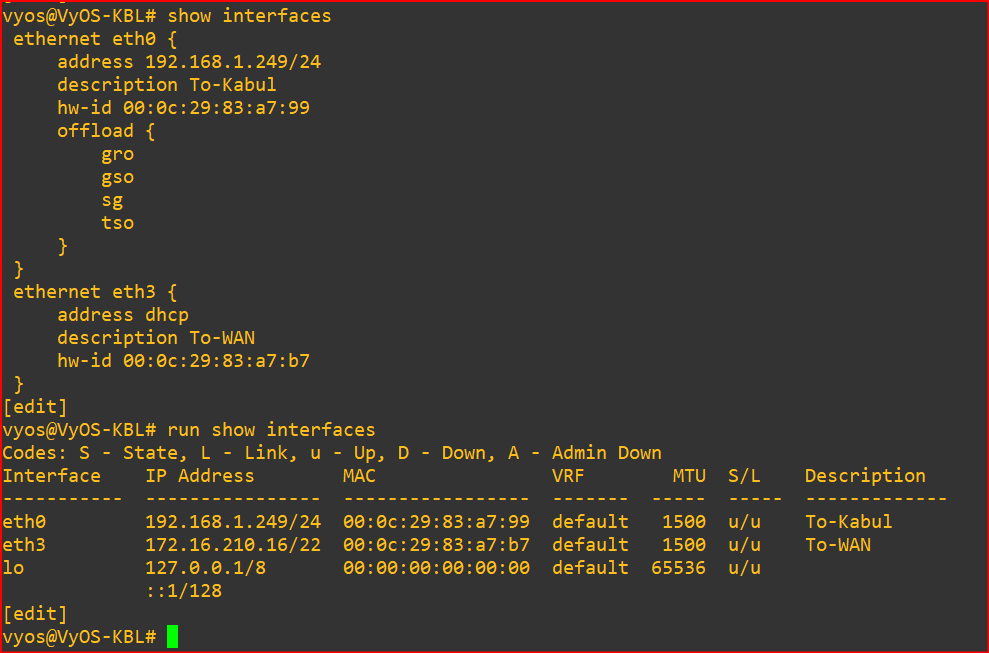

Configure network of the servers existing in each site.

  
  
  

In order to have reachability to each site, we need to configure a routing protocol. In this case we are using OSPF. Configure OSPF on each site's VyOS router following the commands in the image below. 

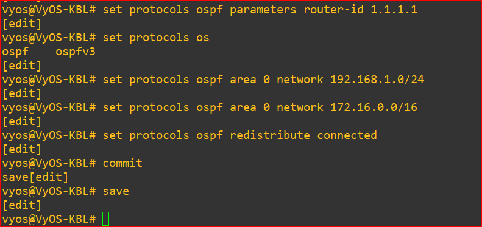

`set protocols ospf redistribute connected` tells VyOS to advertise all directly connected networks (that are not already included via network statements) into OSPF. You can check OSPF neighborship with this command `show ip ospf neighbors`, use `run` with to excute non-configuration commands in configuration mode. Image below shows neighbors associated with KBL router (you can see that it has only one neighbor which is VyOS-MZR. HRT's router hasn't been configured with OSPF yet)

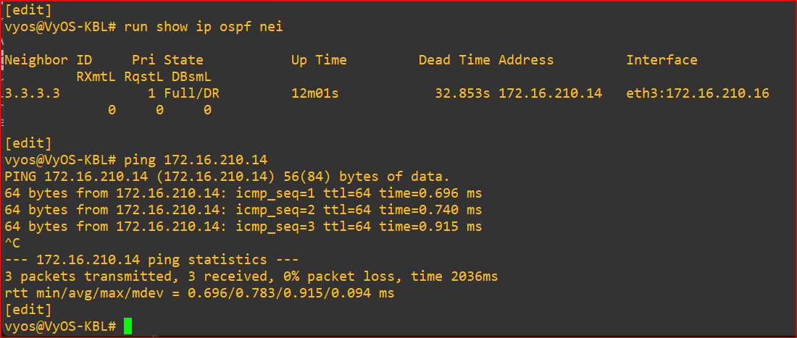

You can set the DNS server of the router using `set system nameserver x.x.x.x` command. You can optionally set a defualt route using your Bridge Network's gateway as the next-hop for the default route.

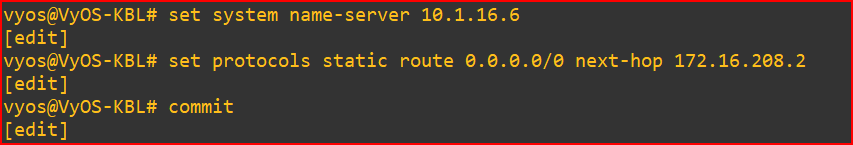

Another important configuration is Network Address Translation (NAT) for the end-hosts in each site to have internet access. Follow below commands to configure NAT in each router:

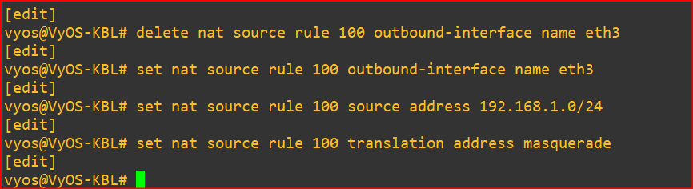

We basically used PAT in this case which is achieved using `set nat source rule 100 translation address masquerade`.
You can verify NAT translations with `show nat source translations` command. After NAT is configured, make sure end hosts have internet access by pinging google.com.

  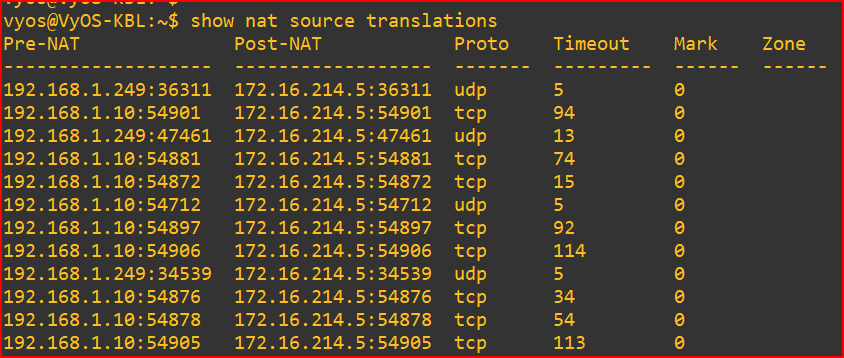
  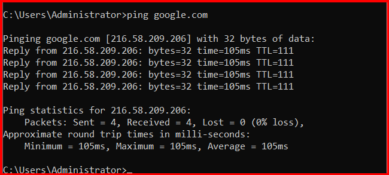

---

# Site-to-Site IPsec VPN Configuration

In this section, we are going to configure site-to-site IPsec VPN between all three sites. We are specifically Route-Based VPN in this lab. For more information you can refer to VyOS documentation of Site-to-Site IPsec [here](https://docs.vyos.io/en/latest/configuration/vpn/ipsec/site2site_ipsec.html)

### IKE Phase 1 (ISAKMP Proposal):
Configure IKE phase 1 on all routers. Remember that the negotiated parameters in this phase must match across all the routers in all sites except for the `lifetime` parameter but it is recommended to use the same value for all peers. Do the same for all the other routers participating in the VPN configuration. Image below shows IKE phase 1 config for KBL router:

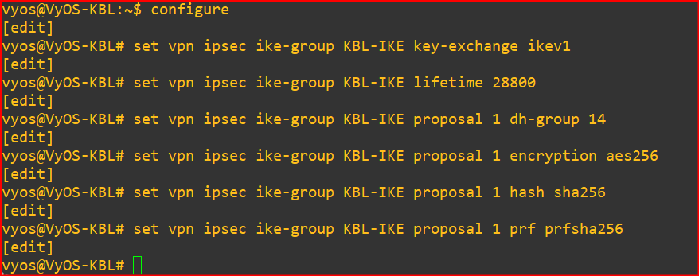

### ESP Phase 2 (IPsec Proposal):
Configure ESP phase 2 on all routers. The parameters must match on all routers. Do the same for all peers:

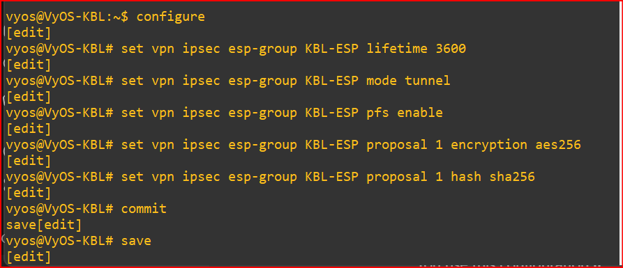

Specify interface facing to the protected destination. In this case eth3 on VyOS-KBL:

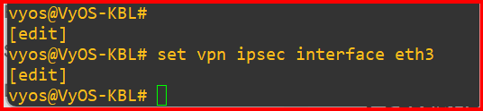

### PSK Configuration:
Configure PSK keys and authentication ids for this key if authentication type is PSK. In our case, there are three peers participating in VPN configuration, so three IDs should be created. Then you need to specify the PSK secret key (same on all peers):

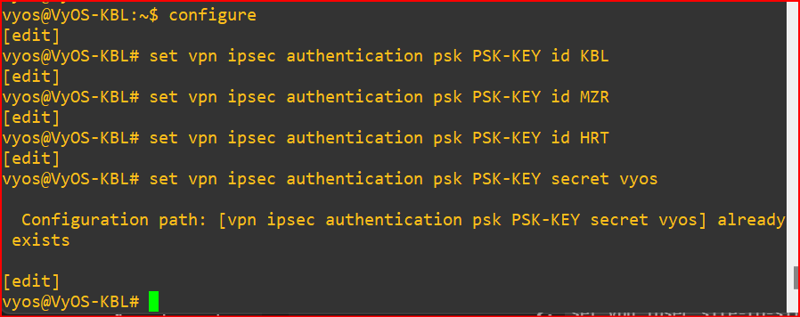

### Configure Peers:
Configure peer and apply IKE-group and esp-group to each peer. Remember `connection type` values are either `initiate` or `respond` in this case. For the VyOS-KBL router, both connections to each peer is set to `initiate`. The `initiate` connection-type indicates that this peer starts the IPsec negotiation (sends the first IKE packet) and `respond` connection-type indicates that the peer waits for incoming IKE negotiations (this connection-type is configured in MZR and HRT sites for KBL peer). The `local-address` and `remote-address` define WAN IP address of the initiator and responder.

HRT Peer configuration:
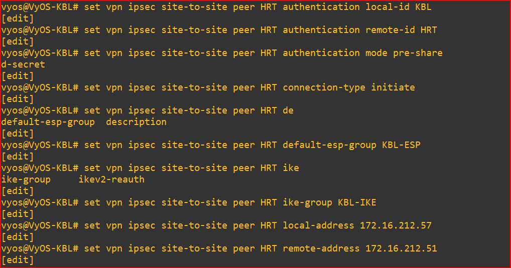
MZR Peer configuration:
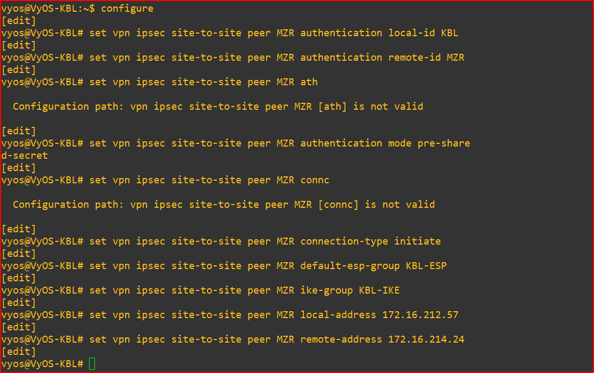

### VTI Tunnels configuration:
For Route-based VPN create VTI interfaces, set IP addresses to these interfaces and bind these interfaces to the VPN peers.

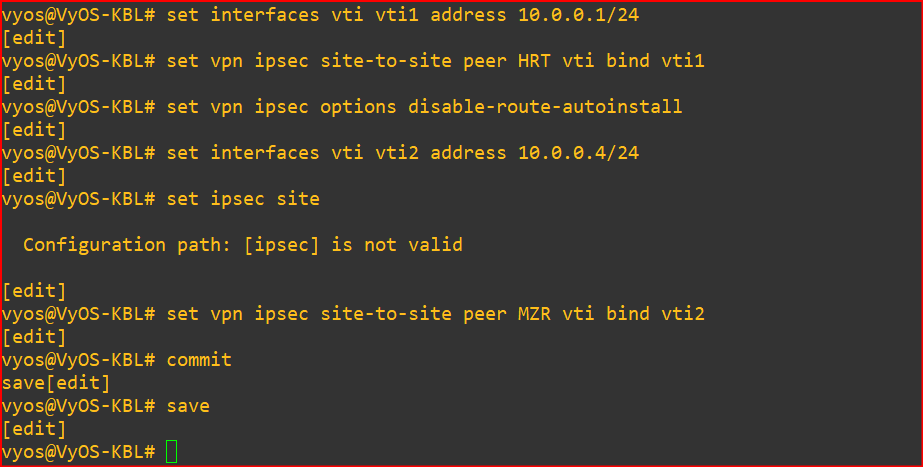

After this, you will need to route the overlay network. Delete the OSPF internal routes (192.168.1.0/24 for VyOS-KBL) and instead route this network and the tunnel network (10.0.0.0/24) using static routes. Remember to use different routing protocols in overlay and underlay to avoid recursive routing. Do this on all routers.

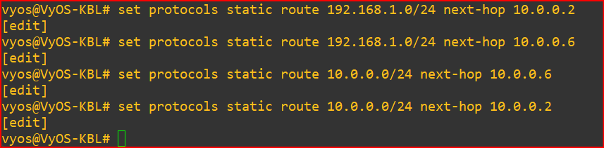

## Checking VPN Configuration:
confirm your VPN connection throughout all sites using `show vpn ike sa` and `show vpn ipsec sa`. Images below show IKE and IPsec establishments for VyOS-HRT:

And
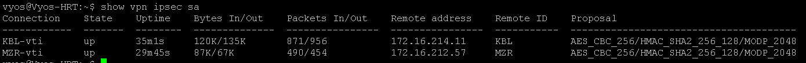

---

# AD DS Installation and Configuration
As part of this lab, We are going to simulate a real-world enterprise network with multiple physical locations and domain controllers.

### 🏷️ Domain Information

- **Domain Name**: `project.lab`
- **Sites**:
  - KBL (main site) --> KBL-DC is the PDC
  - HRT (branch site) --> HRT-DC is the ADC
  - MZR (branch site) --> MZR-DC is the RODC

### AD DS installation:
Inside the Server Manager's Dashboard, go to `Add roles and features`. You'll be prompted with a wizard to install roles and features for the server. Follow the basic steps, in `Server Roles` section select two roles "Active Directory Domain Services" and "DNS Server". Select Next for the other steps and click install at the end:

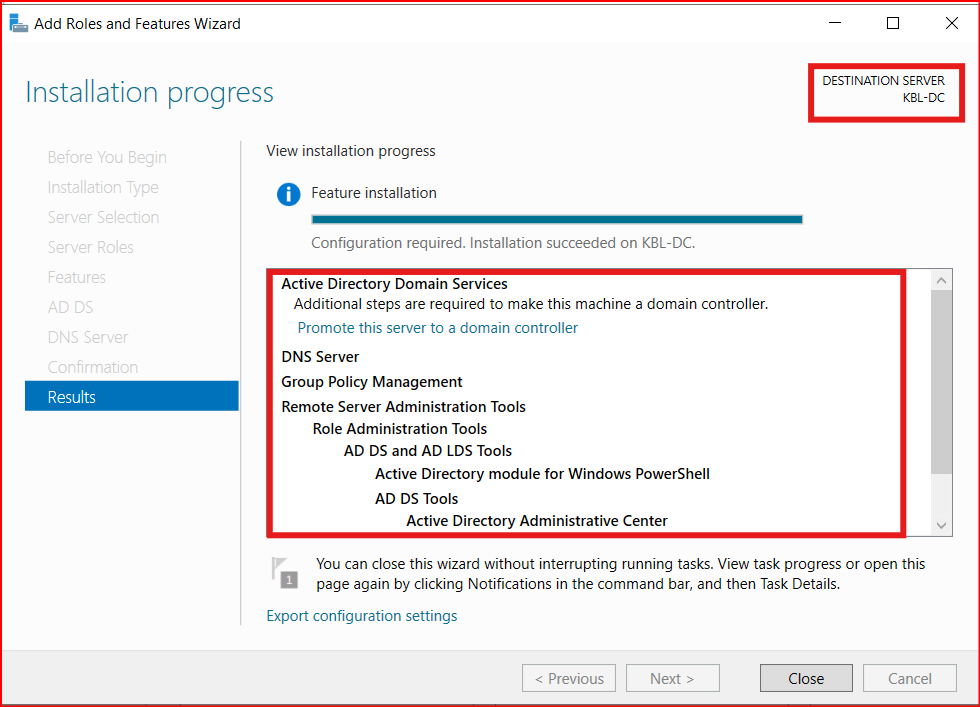

After installation of AD DS, you need to promote the server to a domain controller. Click on `promote this server to a domain controller` on the AD DS installation wizard after installation is done. You'll be prompted with AD DS Configuration Wizard. In the `Deployment Configuration` select "Add a new forest" and then name your root domain (in this case = project.lab). This will indicate that this server will be configured as Primary Domain Controller (PDC). Select Next for other steps and you'll be done with DC promotion.

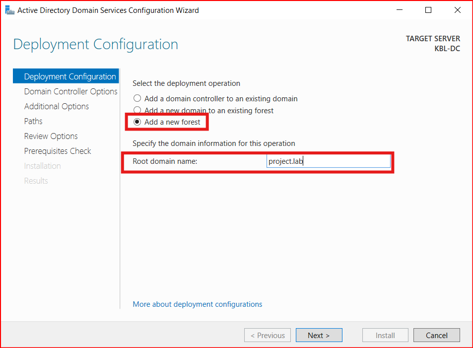

For the HRT-DC, install the AD DS and DNS roles, then promote it. In the `Deployment Configuration` of HRT-DC's configuration wizard, select `Add a domain controller to an existing domain` and provide the name of your previously created domain (project.lab). Click Next for the other steps.

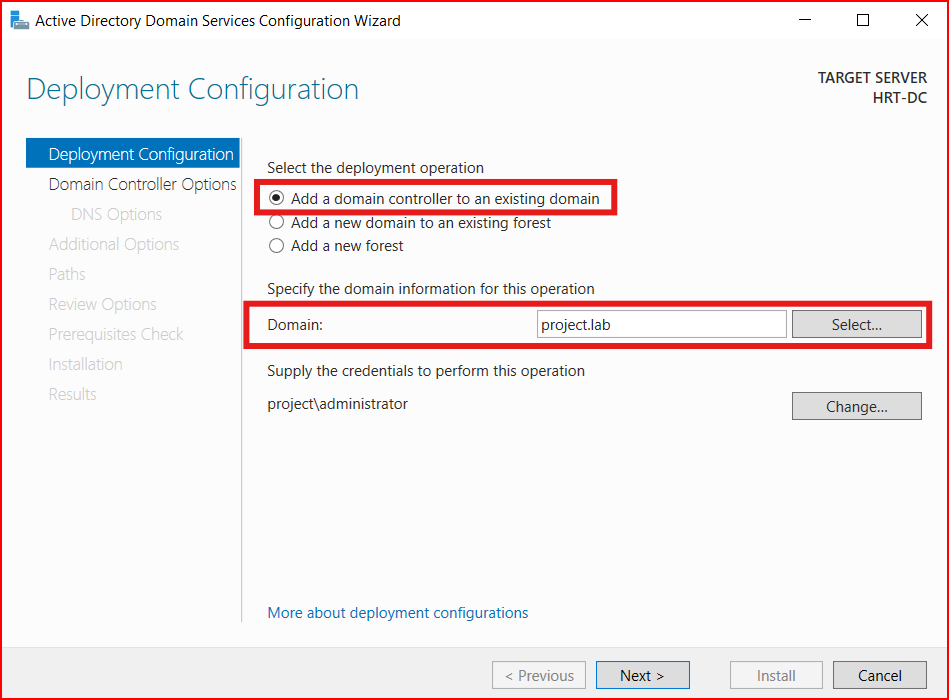

Don't forget to set the Primary DNS of HRT-DC to itself (192.168.2.20 in this case). You can choose to set the alternate DNS server to KBL-DC's IP address. Do this on MZR-DC as well.

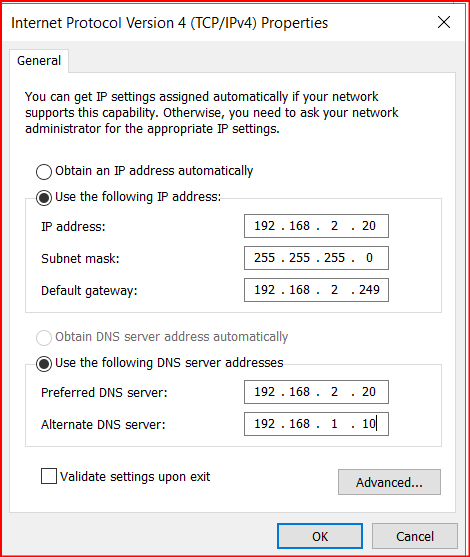

Follow the same step for MZR site. Install the AD DS role and then add it to your existing domain. Remember that in our case, MZR-DC is configured to be a Read-Only Domain Controller (RODC). You can find out more about what a RODC is in [here](https://learn.microsoft.com/en-us/windows/win32/ad/rodc-and-active-directory-schema):

  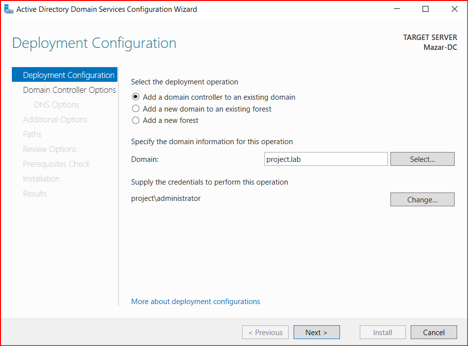
  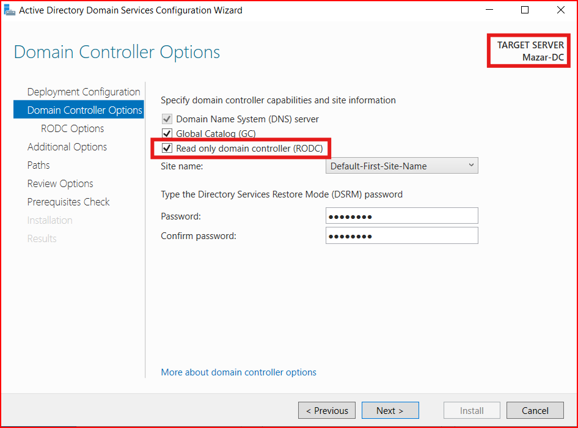

---

### DNS Configuration:
Configure `Forward Lookup Zone` and `Reverse Lookup Zone` of each server.

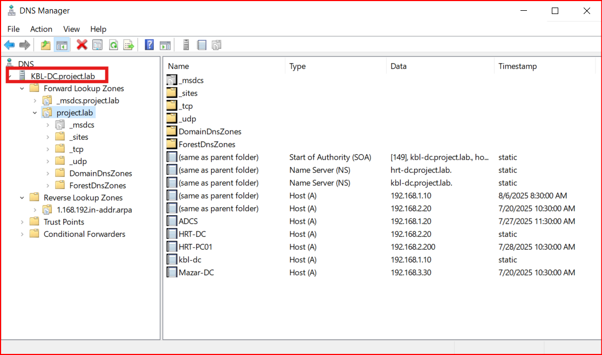

---

### Configuring Sites:
We need to determine our sites by creating sites in the Active Directory Sites and Services.

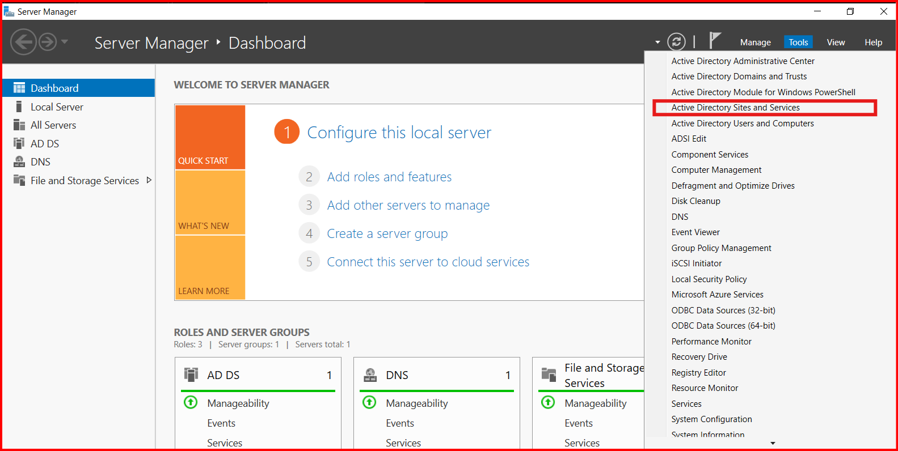

Click on `Sites`, you will see a site called "Default Site", right click on it and rename to the main site (KBL-Site). Right click on `Sites` and choose "New Site" to create a new site, do this for HRT and MZR sites.

Then we need to create subnet for each site. Subnets determine the range of IP addresses used for each site. Go to `Sites` and then `Subnets`, right click on Subnets and choose `new subnet`. Create subnet for each site and configure the IP addresses assessed for each site:

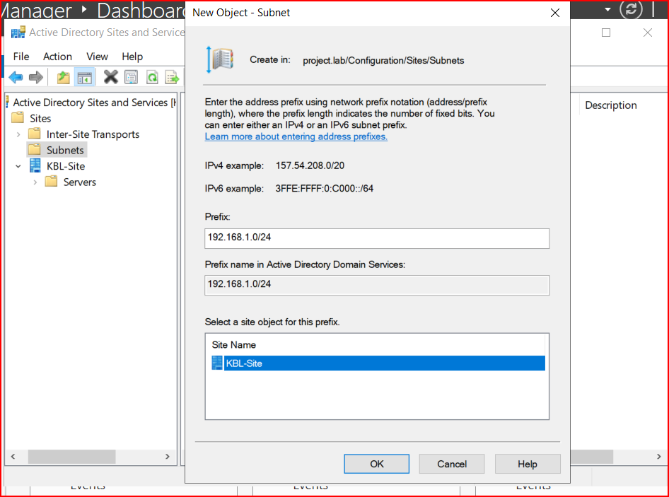

Put each site's DC to its coresponding site. You can drag and drop the servers to each specified site's servers folder:

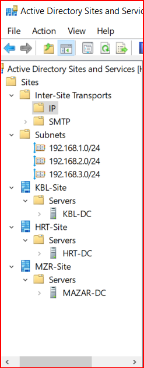

Next, create site links between the sites. An inter-site link is a logical connection in Active Directory that represents the network path between two or more AD sites. It is used by Active Directory replication to transfer changes between domain controllers (DCs) that are in different physical or logical sites. By default, Active Directory inter-site replication happens every 180 minutes. You can change this by going to a site link's properties.

  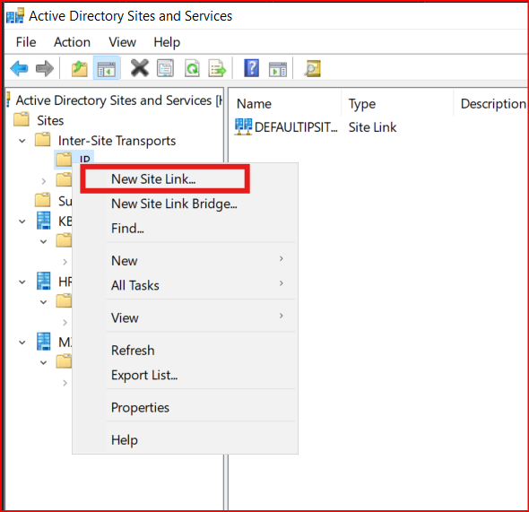
  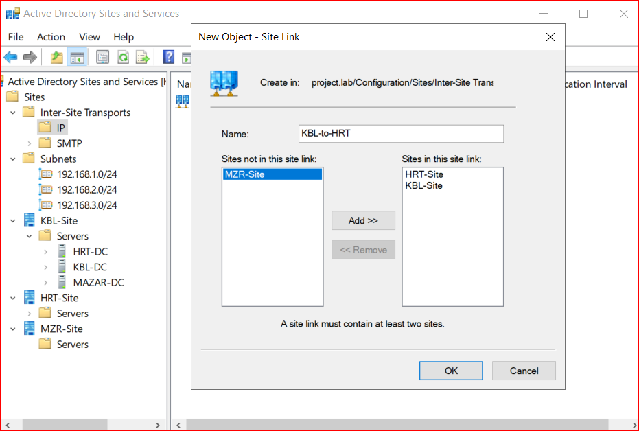

### Replication Test
We can check if replication works through sites. For this we first create an Organizational Unit (OU) inside Active Directory Users and Computers and name it IT. Then we create a user "IT01" inside the OU and see if this is also replicated on HRT-DC and MZR-DC servers:

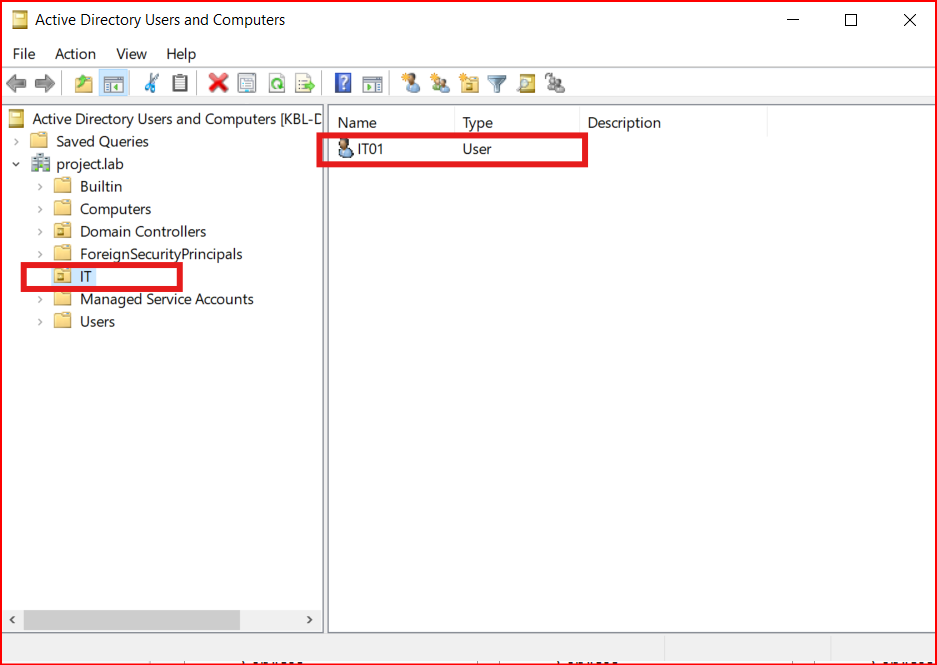

Then go to AD Sites and Services and follow below steps, image below shows replication test for HRT-DC, do the same for MZR-DC:

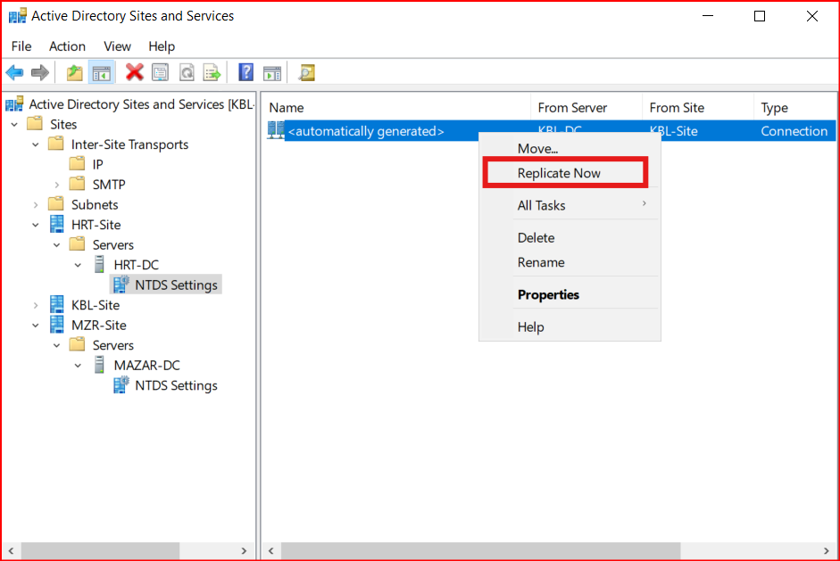

Finally check the HRT-DC and MZR-DC servers if they have recieved the mentioned OU.

  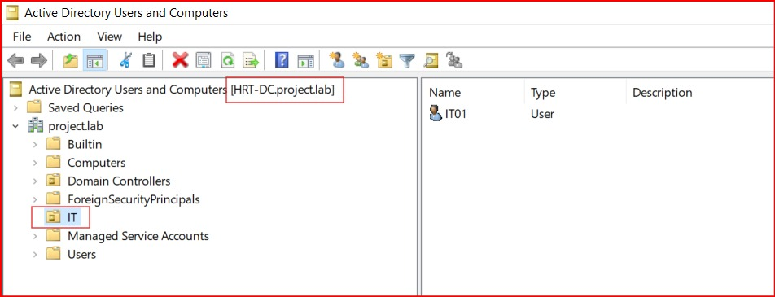
  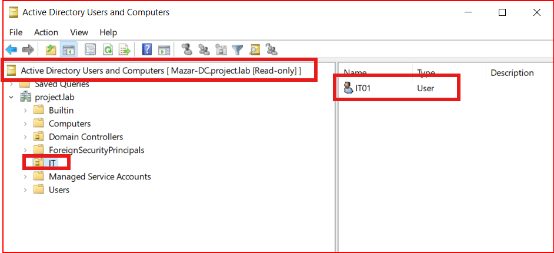

---

# Security Monitoring and Adversary Emulation

2. Splunk Enterprise Setup:
   
   I started by downloading both Splunk Enterprise and Ubuntu Server. Splunk will be hosted on the Ubuntu Server virtual machine.
   
 📌 Introduction to Splunk Enterprise:

 Splunk Enterprise is a widely adopted platform designed for collecting, indexing, and analyzing machine data in real time. It supports log ingestion from a wide range of sources and is commonly used in Security Operations Centers (SOCs) as a Security Information and Event Management (SIEM) solution. With its powerful search capabilities and rich visualizations, Splunk helps security teams detect threats, investigate incidents, and monitor system activity effectively.
2)my benefits from working on splunk on this lab.
Integrating Splunk Enterprise into my home lab environment has been a valuable step toward building practical cybersecurity skills. With this setup, I can continuously monitor system activity, detect suspicious behavior, and simulate real-world SOC operations. This hands-on approach not only strengthens my understanding of how modern security tools work but also improves my ability to respond to potential threats—an essential skillset for anyone pursuing a career in cybersecurity.

⬇️ Downloading Splunk Enterprise (Free Trial)

1.Visit the official [Splunk website](https://www.splunk.com)
2.Log in or create a free account.
3.Navigate to Products > Free Trials and Downloads.
4.Select Splunk Enterprise, then click Get My Free Trial.
5.Choose your host operating system. Since I’m using Ubuntu Server, I selected the Linux .deb package for Debian-based distributions.

2.Downloading Ubuntu server:
 I downloaded the latest LTS version of Ubuntu from the [Ubuntu Downloads page](https://ubuntu.com/download/server). At the time of writing, the newest version available was Ubuntu 24.04.2 LTS, and the ISO file was approximately 3GB

   3.Creating the Ubuntu VM on VMware:
With the ISO downloaded, I proceeded to create the Ubuntu VM on vmware workstation:
-Allocated 2 CPUs, 4 GB RAM, and 30 GB disk space.
-Used VMnet2(hostonly) to ensure connectivity with my vyos router.

  Network Configuration:
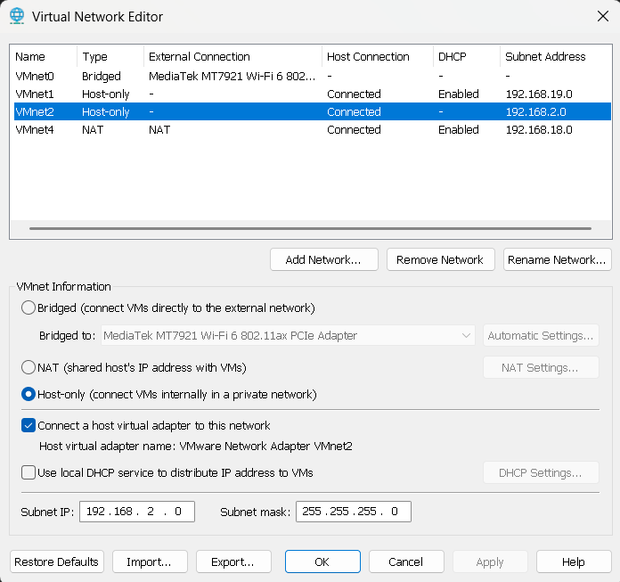

4. Installing Uebntu Server:
I attached the ISO to the new VM and started the system. I used the default installation options, pressing Enter until installation completed and the system rebooted.
5. Enabling Remote Access with PuTTY
After installation, I used PuTTY on my Windows host to connect to the Ubuntu Server VM.
🔌 Prerequisites
The VM must be powered on and connected to the same network as the host.
Ensure OpenSSH Server is installed (enabled by default). If not, install it:
<pre lang="markdown">bash
  sudo apt install openssh-server</pre>
🔍 Finding the IP Address
Run this command on the Ubuntu VM:
<pre lang="markdown">bash
  ip a</pre>
📸 Example:
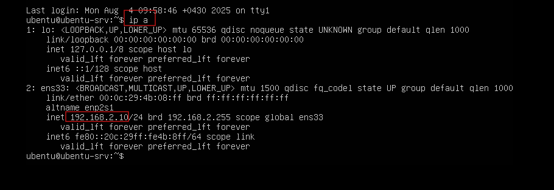
💻 Access via PuTTY
Open PuTTY on Windows.
Enter the IP address in the Host Name field.
Set Port to 22 and Connection Type to SSH.
Click Open.
📸 PuTTY Configuration:
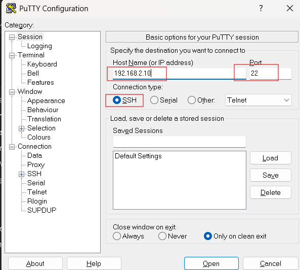
Log In
A terminal window will open
Enter your Ubuntu username and password
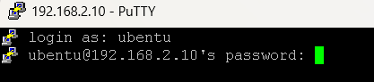
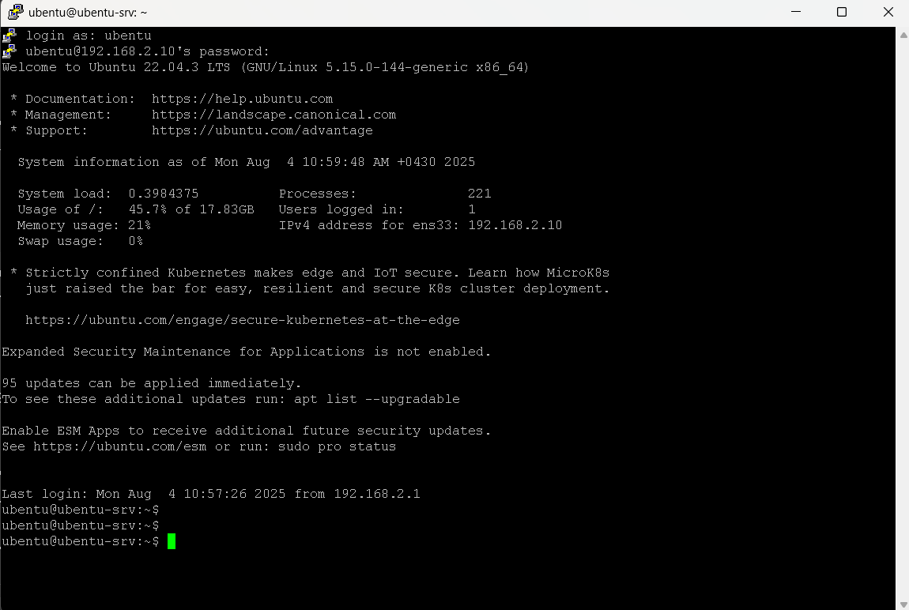
   

I then took a snapshot of the VM at this clean, fully updated state to serve as a baseline for future rollback if needed.

7) uentu server network config:
   Since I'm working in the HRT-Site environment, I assigned the following static IP settings:
-IP Address: 192.168.2.10
-Gateway: My VyOS router
-DNS Server: My home router's IP (instead of 8.8.8.8, since external DNS is filtered in my country)
⚠️ Note: Setting DNS to 8.8.8.8 caused internet loss due to regional filtering. Using my home router as DNS resolved the issue.
🛠️ To Set Static IP
Edit the Netplan configuration file:
<pre lang="Markdown">bash
  sudo nano /etc/netplan/00-installer-config.yaml</pre>
📸 Netplan Configuration:
   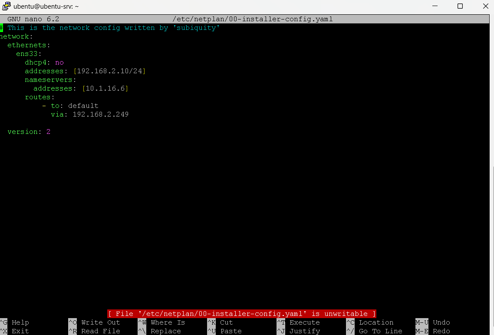
   Apply changes and verify internet connectivity:
   <pre lang="markdown"> bash 
   sudo netplan apply
   ping google.com </pre>
   📸 Ping Test:
 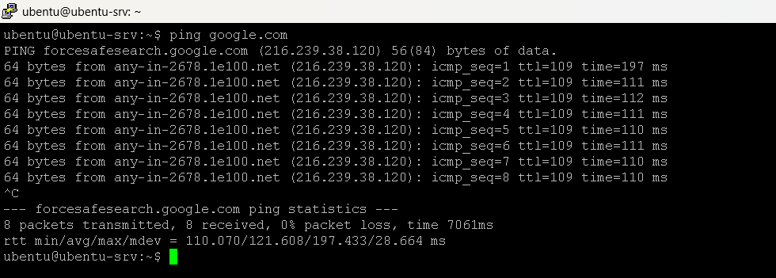
7. System Update
Finally, I updated the Ubuntu system to ensure all packages were current:
<pre lang="markdown">bash
sudo apt update
sudo apt upgrade</pre>

8.⚙️ Installing VMware Tools on Ubuntu Server
Installing VMware Tools improves virtual machine performance and enables features such as better network drivers, time synchronization, and smoother integration with the host system.
and aslo we need to share splunk setup from host machine wit the vm(ubentu server).
For Ubuntu Server, the recommended method is to install the open-vm-tools package provided through the official Ubuntu repositories.
📦 Step-by-Step Guide
Update Package List
<pre lang="Markdown">
bash
sudo apt update
</pre>
Install Open VM Tools 
<pre lang="Markdown">
bash
sudo apt install open-vm-tools -y
</pre>
Verify the Installation
Check the version to confirm installation:
<pre lang="Markdown">
bash
vmware-toolbox-cmd -v
</pre>
[vmTool](images/sec/vmTool)
📌 Notes
There's no need to mount the ISO or install VMware Tools manually—the open-vm-tools package is the official and preferred method for Ubuntu.
Now that VMware Tools is installed, your VM will perform better, and features like time sync and graceful shutdown will work reliably.

🔄 Sharing Splunk Installer from Host to Ubuntu Server VM
To transfer the Splunk Enterprise installer from your Windows host machine to your Ubuntu Server VM, you can use a VMware feature called Shared Folders. This allows your virtual machine to access a directory from your host system as if it were part of the VM's file system.

🧰 What is Shared Folders?
Shared Folders is a VMware Workstation/Player feature that enables file sharing between the host and guest systems without using USB drives, SCP, or network file transfers. It's ideal for quickly moving files like installers, scripts, or configuration files.

📦 Step-by-Step Guide to Enable Shared Folders
🔒 Ensure VMware Tools (open-vm-tools) is installed and running on your Ubuntu Server before proceeding.
1. Configure Shared Folder in VMware
-Power off your Ubuntu VM (if it's running).
-Open VMware Workstation or Player.
-Select your VM > Click Edit virtual machine settings.
-Go to the Options tab.
-Select Shared Folders.

Example:

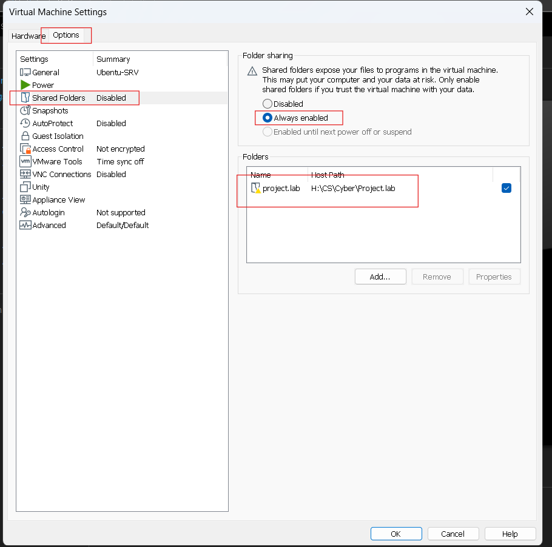
-Choose Always enabled or Enabled until next power off or suspend.
-Click Add… and:
-Browse to the folder on your host where the Splunk installer (.deb file) is located.
-Give it a name like splunk-share.
-Click Finish, then OK to apply the changes.
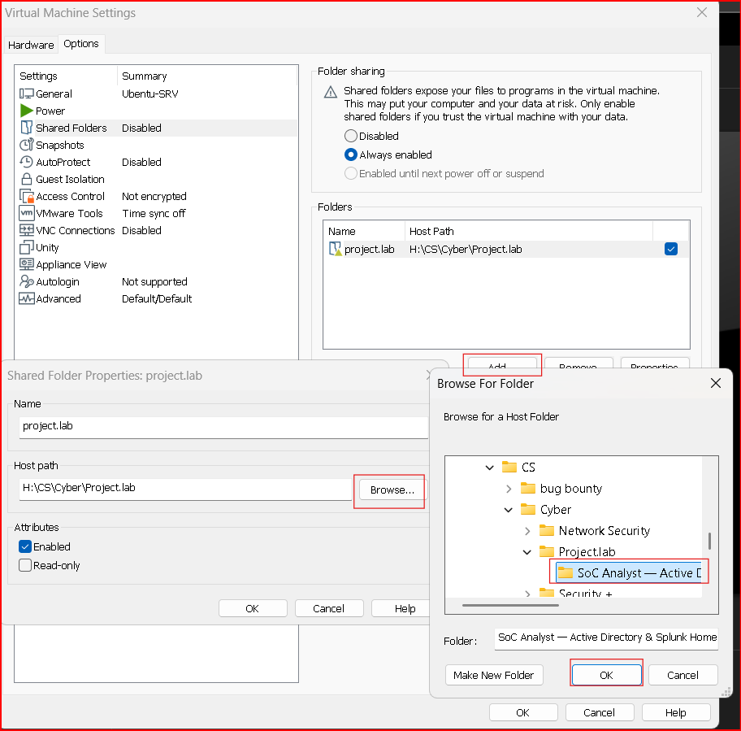
-Start your Ubuntu VM.

2. Access the Shared Folder in Ubuntu
   
Once the VM is running, VMware automatically mounts the shared folder to the path:

<pre lang="Markdown">bash
cd /mnt/hgfs
</pre>

To view the shared folder:

<pre lang="Markdown">bash
  ls /mnt/hgfs
</pre>

and if you couldn't see your shared folder after ruuning the above command, try this command first

<pre lang="Markdown">bash
  sudo vmhgfs-fuse .host:/ /mnt/hgfs -o allow_other
</pre>

  This command mounts the shared folder from the VMware host system into your Ubuntu Server VM, using VMware’s FUSE-based file system.

You should see your shared folder name(e.g.,project.lab):

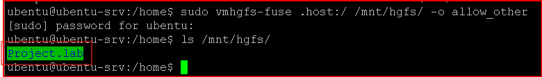

access the shared folder

<pre lang="Markdown">bash
  cd /mnt/hgfs/splunk-share
</pre>

Now you can access the Splunk installer from there and install it:

<pre lang="Markdown">bash
sudo dpkg -i splunk-*.deb
</pre>

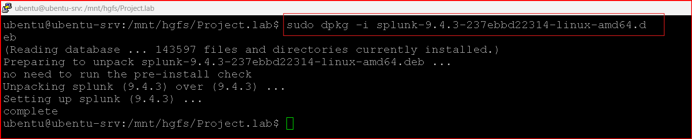

🛠️ You may need to run sudo apt --fix-broken install if dependencies are missing.

now change to the direcorty where splunk is:

<pre lang="Markdown">bash
  cd /opt/splunk
</pre>

and list it's contains:

<pre lang="Markdown">bash
  ls -la
</pre>

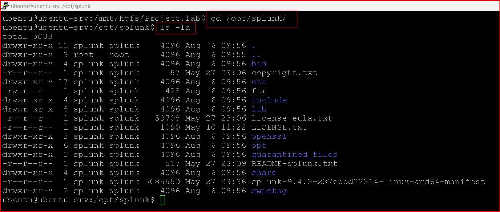

this shows that splunk is installed successfully

now hit to the follwing directory and run the follwing commands which will run splunk:

<pre lang="Markdown">bash
cd /bin/splunk
  sudo ./splunk start
</pre>

go through the liesanse aggrement and you will be asked to a username and password. 

now we want to enable splunk on boot so every time the vm boots up splunk will be running:

<pre lang="Markdonw">bash
  cd bin
  sudo ./splunk enable boot-start
</pre>

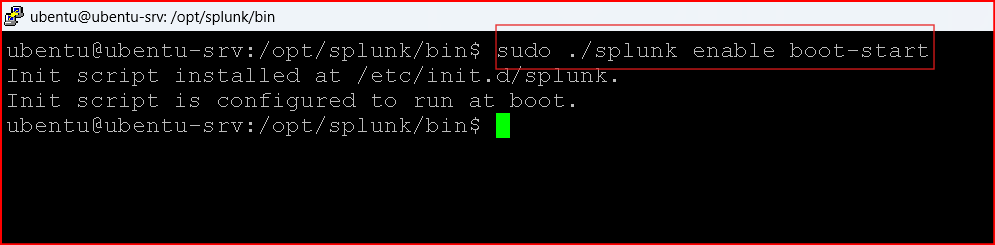

the next step is to install splunk forwarder on our windows machines. I am going to demostrate how I did it on windows 10. It should be the same accross other vms too. 
First we need to join my windows mashine to the domain. To do so will asign a static ip address to it and check it's reachblitiy with the DC.

My windows 10's network adapter is in vmnet2(Hostonly) which is the same vmnet in which my ubentu server, vyos router and kali lunix are.

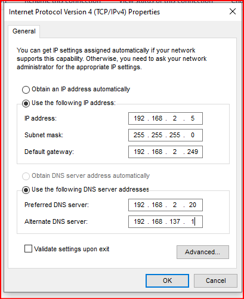

I joined my windows 10 vm to project.lab domain and also renamed it to HRT-PC01

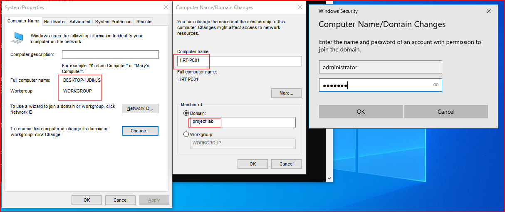

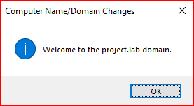

afterwards you pc will require a reboot and then log in as a domain user:

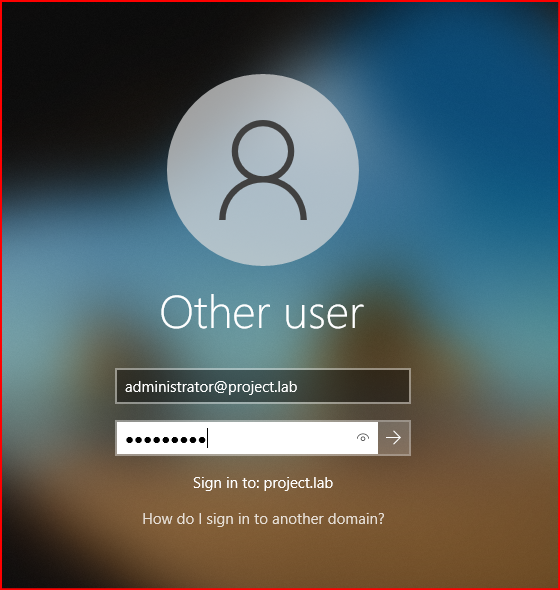

now my vm is a part of project.lab domain

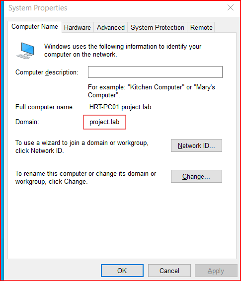

📦 What is Splunk Universal Forwarder?
The Splunk Universal Forwarder (UF) is a lightweight version of Splunk designed specifically for collecting and forwarding logs and machine data to a central Splunk instance (typically a Splunk Enterprise or Splunk Cloud server). It runs as a background service and is optimized for minimal resource usage while maintaining high-speed data transfer.

Unlike the full Splunk Enterprise instance, the Universal Forwarder has no web interface or data indexing capabilities. Its primary role is to gather data (e.g., Windows Event Logs, files, registry, or performance metrics) from the host and send it to a central Splunk indexer or heavy forwarder.

🧠 Why Use Splunk Forwarder?
Using a Universal Forwarder in a distributed Splunk architecture offers several key benefits:

Centralized Logging: Collect logs from multiple endpoints and forward them to a centralized Splunk server for analysis and visualization.

Lightweight & Efficient: Designed to run with minimal system impact, making it ideal for desktops, servers, or embedded systems.

Secure Data Transmission: Supports encrypted and authenticated communication with your Splunk indexers.

Real-time Data Delivery: Enables near real-time forwarding of logs, which is crucial for security monitoring, incident response, and compliance.

In this documentation, we will walk through the steps to install and configure the Splunk Universal Forwarder on a Windows 10 machine and ensure it forwards logs to a Splunk Enterprise server running on a different system (in our case, an Ubuntu server).

📥 Step 1: Download and Install the Forwarder
Download the 64-bit MSI installer for Windows.
head to the [splunk website](https://www.splunk.com/) and log in or sing up then go to the products and click on splunk forwarder and use the free trieal option chose the one which fits your os for me it's the 64 bit windows with .msi extention. 
  
 

afterwards run the installer with default settings, since we don't use deploment server just leave it empty and hit next when you get to recieving server supply your ubentu server's ip address with the default 9997 as port.

after the installation is finished 

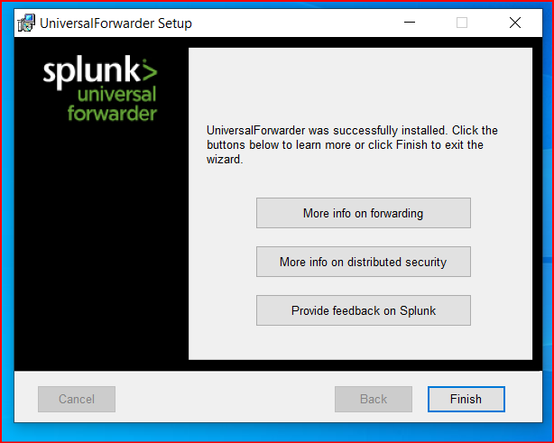

🔧 Configuring Splunk Universal Forwarder to Send Windows Event Logs to a Specific Index

To configure which telemetry data (Windows Event Logs) the Splunk Universal Forwarder should send and to which index, follow these steps:

✅ Step 1: Create the inputs.conf File
1.Open Notepad as Administrator

-Click on Start, search for Notepad

-Right-click Notepad → Run as administrator

2.Paste the following configuration into Notepad:

<pre lang="Markdown">

  [WinEventLog://Application]
index = endpoint
disabled = false

[WinEventLog://Security]
index = endpoint
disabled = false

[WinEventLog://System]
index = endpoint
disabled = false

[WinEventLog://Microsoft-Windows-Sysmon/Operational]
index = endpoint
disabled = false
renderXml = true
source = XmlWinEventLog:Microsoft-Windows-Sysmon/Operational
  
</pre>

🔁 You can customize the index name as desired. For example, I used HRT-PC01 to match the name of my VM.

3.Save the file to the following path:

<pre lang="Markdown">
  
C:\Program Files\SplunkUniversalForwarder\etc\system\local\inputs.conf
  
</pre>

This configuration tells the Universal Forwarder to collect logs from:

-Application

-Security

-System

-Sysmon Operational Channel

And forwards them all to the specified Splunk index (e.g., endpoint).

✅ Restarting the Splunk Forwarder Service
Once the configuration changes are made (e.g., updating inputs.conf or outputs.conf), you need to restart the Splunk Forwarder service to apply those changes:

1.Press Win + R, type services.msc, and hit Enter.

2.In the Services window, locate SplunkForwarder.

3.Right-click it and choose Restart.

👤 Service Account Check
Make sure the Splunk Forwarder service is running under the Local System account:

Right-click on SplunkForwarder in Services and select Properties.

1.Go to the Log On tab.

2.Ensure Local System account is selected.

-If not, change it to Local System and restart the service again.

-This ensures the forwarder has sufficient permissions to collect logs from Sysmon and Windows event logs.

[localSystemAccount](images/sec/localSystemAccount.png)
  
it's now time to downlaod , install and configure sysmon

🔍 What is Sysmon?

Sysmon (System Monitor) is a Windows system service and device driver developed by Microsoft as part of the Sysinternals Suite. It provides detailed information about process creations, network connections, and file creation time changes, among other system activity.

Sysmon logs this data to the Windows Event Log under the Microsoft-Windows-Sysmon/Operational channel. This high-fidelity logging is extremely valuable for threat detection, incident response, and behavioral monitoring.

🧪 How Sysmon Relates to This Lab

In this lab environment, we simulate attack scenarios like brute-force attempts on RDP using Kali Linux and generate malicious behavior using Atomic Red Team. Sysmon acts as our local telemetry collector, recording fine-grained security events on the Windows machines.

These logs are then collected by the Splunk Universal Forwarder and sent to the Splunk Enterprise server for indexing and analysis. By using Sysmon, we enhance the visibility of suspicious or malicious activities, helping us to detect and investigate incidents effectively through Splunk dashboards and alerts.

⬇️ How to Download Sysmon
Navigate to the official Sysinternals website:

🔗 [sysmon](https://learn.microsoft.com/en-us/sysinternals/downloads/sysmon)

Click the Download Sysmon button to download a ZIP file containing:

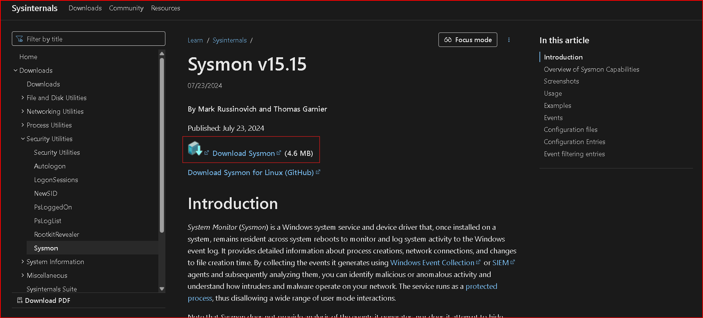

-Sysmon.exe – the executable to run Sysmon.

-Sysmon64.exe – 64-bit version.

-EULA.txt – license agreement.

-Extract the contents of the ZIP file to a directory of your choice (e.g., C:\Sysmon).

now we need a configuration fie for sysmon , for thsi lab I used Olaf's configuration.

🛠️ Sysmon Config by Olaf Hartong

To enhance the visibility and effectiveness of Sysmon in detecting suspicious activity, we use a community-developed configuration file maintained by Olaf Hartong. Olaf's Sysmon config is a well-maintained, modular, and security-focused configuration designed to maximize valuable event logging while reducing noise.

This configuration includes predefined rules for detecting various tactics and techniques based on the MITRE ATT&CK framework. It is widely adopted in blue team environments and threat hunting labs.

📥 How to Download
You can download the latest version of Olaf’s Sysmon configuration from his GitHub repository using the following steps:

Visit the repository:

🔗[github repo](https://raw.githubusercontent.com/olafhartong/sysmon-modular/master/sysmonconfig.xml)

once you visited  the webpage right click it and hit save as. 

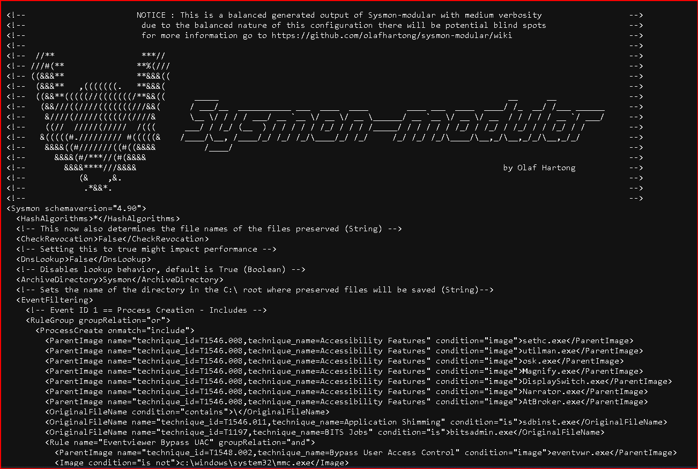

extrct sysmon and put the extracted file on the same direcotry as sysmonconfig.xml and open powershell in the direcotyr.

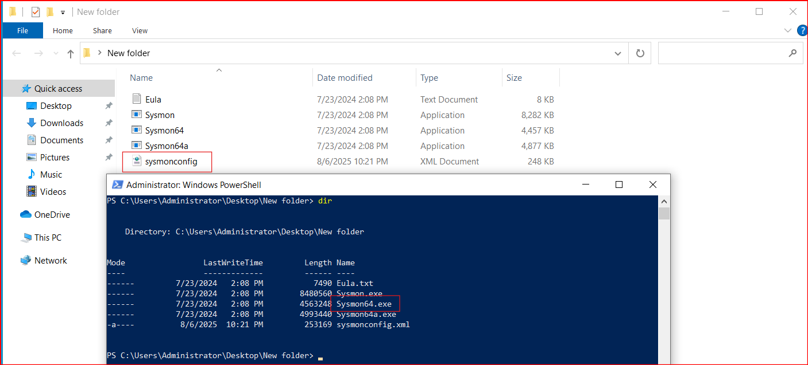

then run this command:

<pre lang="Markdown">
  powershell

  .\sysmon64.exe -i .\sysmonconfig.xml

</pre>

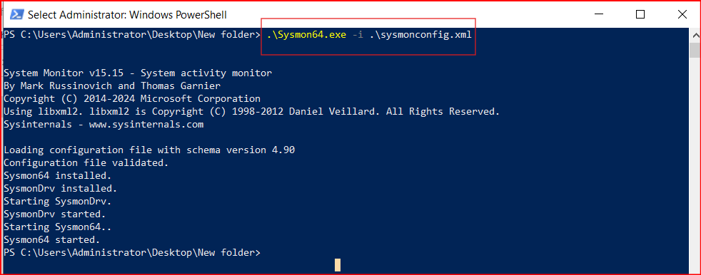

Accessing the Splunk Web Interface
Now that both Splunk and Sysmon are properly configured, it's time to make a few final configurations on the Splunk server itself.

Ensure that your Ubuntu server (running Splunk) and your Windows VM (running Sysmon) are on the same network and can communicate with each other. In my setup, both machines are connected to VMnet2, which is configured as a Host-only network in VMware.

To access the Splunk Web Interface:

1.Open your browser on your host machine.

2.In the address bar, type the IP address of your Ubuntu server followed by port 8000.
Example:
http://192.168.2.10:8000

3.This will bring up the Splunk login page. Use the credentials you created during the installation to log in.

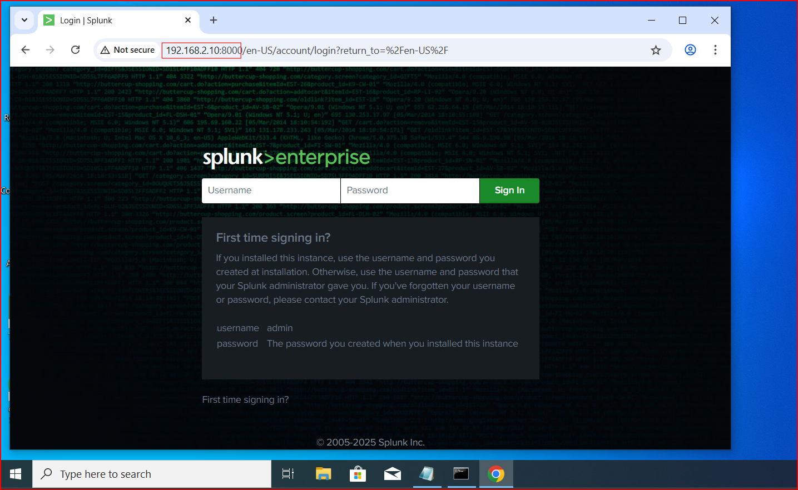

 Create a New Index in Splunk
 
After logging in to the Splunk Web Interface:

1.Go to the Settings menu (top right).

2.Click on Indexes.

3.On the Indexes page, click New Index.

4.Name the index:
  
  I named it HRT-PC01
  ⚠️ Make sure the name matches the one used in the inputs.conf file.

  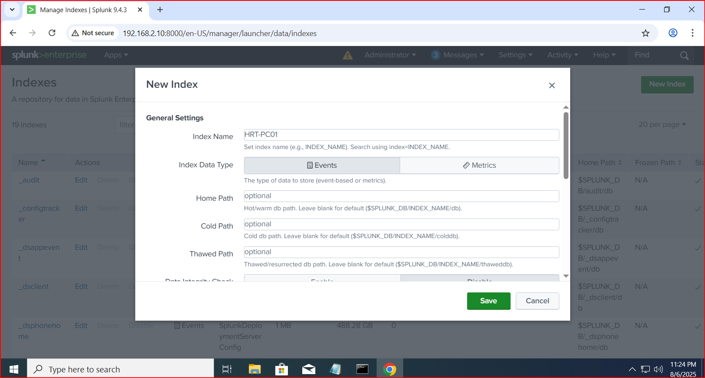

  Leave other settings as default or adjust based on your preference.

Click Save.

  you should be able to see your newly created index:

  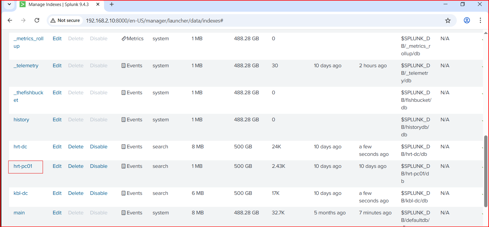

  
🔄 Step 4: Configure Splunk to Receive Logs
To allow your Splunk server to receive logs from the forwarder (HRT-PC01):

In splunk web interface navigate to Settings > Forwarding and receiving.

Under Receive data, click Add new.

Enter 9997 as the port number and click Save.

🔐 This is the port the Universal Forwarder will use to send data to Splunk. Ensure this port is open in your firewall if applicable.

✅ At this point, your Splunk server is now ready to receive data on port 9997.

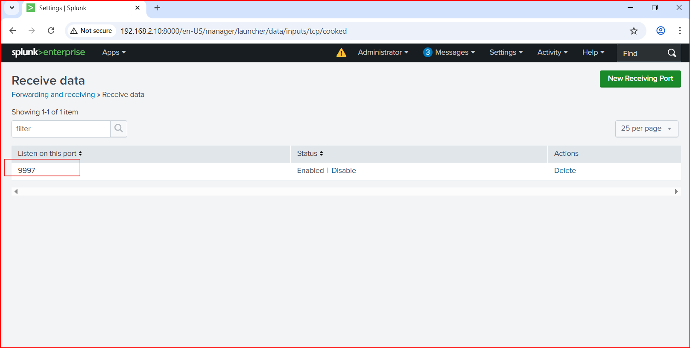

Step 7: Verify Endpoint Telemetry in Splunk

Head over to the Apps section in the top navigation bar.

Select Search & Reporting.

In the search bar, type:
<pre lang="Markdown">
spl
index="HRT-PC01"
</pre>
Press Enter.

You will now see all telemetry data that Splunk has received from the Windows endpoint HRT-PC01.

This data includes logs collected by Sysmon such as process creation, network connections, registry changes, and more—offering detailed visibility into system activity that can be used for detection and investigatio

  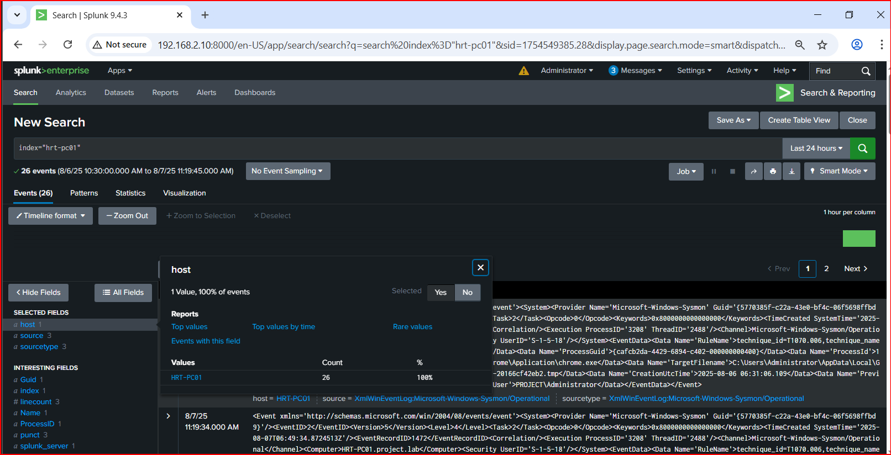
  
