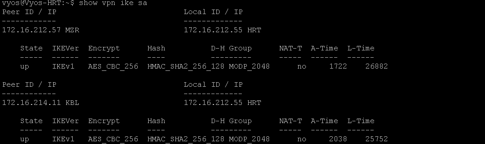

# Multisite Active Directory Collaborated Lab with IPsec VPN and Security Monitoring
Welcome to the multisite active directory lab with site-to-site VPN configuration and implemented security measures. This lab has been created in collaboration with [edris526](https://github.com/edris526).

This project simulates a realistic enterprise network environment across three geographically separated Active Directory (AD) sites, interconnected through IPSec VPN tunnels. It provides a platform for blue team monitoring and red team simulation, suitable for learning, research, and testing in cybersecurity and system administration.

# Project Overview

## 🌐 Domain: `project.lab`

### 🏢 Sites Overview

- **KBL SITE** (`192.168.1.0/24`)  
  - Server: `KBL-SRV`  
  - Roles: Splunk Universal Forwarder, Sysmon  
  - VPN Connection: IPSec Tunnel to MZR and HRT

- **HRT SITE** (`192.168.2.0/24`)  
  - Domain Controller: `HRT-SRV (ADC)`
      - Roles: Splunk Universal Forwarder, Sysmon 
  - Ubentu Server: Splunk Indexer  
  - Endpoints:
    - `Windows 10 Client`: Atomic Red Team
    - `Kali Linux`: Simulated attacker system  
  - VPN Connection: IPSec Tunnel to MZR and KBL

- **MZR SITE** (`192.168.3.0/24`)  
  - Server: `MZR-SRV`  
  - Roles: Splunk Universal Forwarder, Sysmon  
  - VPN Connection: IPSec Tunnel to KBL and HRT

---

## 🔐 Security & Monitoring Stack

- **IPSec Site-to-Site VPN**  
  Ensures secure and encrypted communication between the AD sites using virtual tunnel interfaces (VTIs).

- **Splunk Monitoring**
  - **Indexer** hosted at HRT
  - **Universal Forwarders** installed on all servers
  - **Sysmon** for endpoint visibility and Windows telemetry

- **Atomic Red Team (ART)**
  - Deployed at **HRT site** to simulate adversary behavior for security testing and detection engineering.

- **Red Team Simulation**
  - `Kali Linux` machine performs **brute-force attacks** on the Windows 10 system's **RDP service** using the **Hydra tool**.
  - Attack telemetry is collected and analyzed via Splunk.

---

## 🎯 Objectives

- Build a secure, isolated, and production-like multi-site AD infrastructure.
- Implement encrypted routing between sites using IPSec VPN.
- Gain hands-on experience with log aggregation and detection engineering using Splunk.
- Test endpoint detection and response (EDR) strategies with Sysmon and ART.
- Simulate real-world attacks and analyze their artifacts in a monitored environment.

---

## 📁 Tools & Technologies

- **VMware:** used for virtualization of network components (VyOS routers and end-hosts)
- **Windows Server 2019/2022**, **Windows 10**
- **Kali Linux**
- **Splunk Enterprise**, **Splunk Universal Forwarder**
- **Sysmon**
- **Atomic Red Team**
- **Hydra**
- **VyOS**

---

## 🧠 Ideal For:

- Students and professionals learning enterprise AD topology
- Blue teamers practicing log analysis and detection
- Red teamers testing adversary simulation in isolated labs
- SOC analysts refining Splunk dashboards and alerts

---

# Network Configuration

We are going to use VMware for the servers and routers virtualization. In this project, all routers and servers have been previously installed so you need to be able to install virtual machines such as Windows Server 2022 and VyOS routers by yourself. 

Each VyOS router needs at least two interfaces, one for the internal network (with a host-only VMnet) and another for WAN purposes (Using a VMnet with Bridge mode). In VMware go to `Edit` then click on `Vitual Network Editor`. You need to configure two VMnets (in this case, VMnet0 for Bridge adapter and VMnet1 for host-only). Then you have to go to your router's settings and add another Network adapter. Set each adapter to the correct VMnet. Do this for all routers. (the images below show VyOS-KBL's VMnet setup)

  
  

Now you can configure your router's interfaces. In order to apply changes to VyOS interfaces you need to go to 'configure' mode by using `configure` command. Then use this command `set interfaces ethernet eth0 address x.x.x.x/x` to manually set IP Address of a router's interface. Use `set interfaces ethernet eth1 address dhcp` for the bridged interfaces of the router to get an IP from the Bridge Network of your computer. You can optionally use `set interfaces ethernet eth0 description To-KBL` to set a description for your interface. Don't forget to commit and save your changes by `commit` and `save` commands. You can run `show interfaces` command to list the interfaces. Image below shows the interface config for the VyOS-KBL:

Configure network of the servers existing in each site.

  
  
  

In order to have reachability to each site, we need to configure a routing protocol. In this case we are using OSPF. Configure OSPF on each site's VyOS router following the commands in the image below. 

`set protocols ospf redistribute connected` tells VyOS to advertise all directly connected networks (that are not already included via network statements) into OSPF. You can check OSPF neighborship with this command `show ip ospf neighbors`, use `run` with to excute non-configuration commands in configuration mode. Image below shows neighbors associated with KBL router (you can see that it has only one neighbor which is VyOS-MZR. HRT's router hasn't been configured with OSPF yet)

You can set the DNS server of the router using `set system nameserver x.x.x.x` command. You can optionally set a defualt route using your Bridge Network's gateway as the next-hop for the default route.

Another important configuration is Network Address Translation (NAT) for the end-hosts in each site to have internet access. Follow below commands to configure NAT in each router:

We basically used PAT in this case which is achieved using `set nat source rule 100 translation address masquerade`.
You can verify NAT translations with `show nat source translations` command. After NAT is configured, make sure end hosts have internet access by pinging google.com.

  
  

---

# Site-to-Site IPsec VPN Configuration

In this section, we are going to configure site-to-site IPsec VPN between all three sites. We are specifically Route-Based VPN in this lab. For more information you can refer to VyOS documentation of Site-to-Site IPsec [here](https://docs.vyos.io/en/latest/configuration/vpn/ipsec/site2site_ipsec.html)

## IKE Phase 1 (ISAKMP Proposal):
Configure IKE phase 1 on all routers. Remember that the negotiated parameters in this phase must match across all the routers in all sites except for the `lifetime` parameter but it is recommended to use the same value for all peers. Do the same for all the other routers participating in the VPN configuration. Image below shows IKE phase 1 config for KBL router:

## ESP Phase 2 (IPsec Proposal):
Configure ESP phase 2 on all routers. The parameters must match on all routers. Do the same for all peers:

Specify interface facing to the protected destination. In this case eth3 on VyOS-KBL:

## PSK Configuration:
Configure PSK keys and authentication ids for this key if authentication type is PSK. In our case, there are three peers participating in VPN configuration, so three IDs should be created. Then you need to specify the PSK secret key (same on all peers):

## Configure Peers:
Configure peer and apply IKE-group and esp-group to each peer. Remember `connection type` values are either `initiate` or `respond` in this case. For the VyOS-KBL router, both connections to each peer is set to `initiate`. The `initiate` connection-type indicates that this peer starts the IPsec negotiation (sends the first IKE packet) and `respond` connection-type indicates that the peer waits for incoming IKE negotiations (this connection-type is configured in MZR and HRT sites for KBL peer). The `local-address` and `remote-address` define WAN IP address of the initiator and responder.

HRT Peer configuration:

MZR Peer configuration:

## VTI Tunnels configuration:
For Route-based VPN create VTI interfaces, set IP addresses to these interfaces and bind these interfaces to the VPN peers.

After this, you will need to route the overlay network. Delete the OSPF internal routes (192.168.1.0/24 for VyOS-KBL) and instead route this network and the tunnel network (10.0.0.0/24) using static routes. Remember to use different routing protocols in overlay and underlay to avoid recursive routing. Do this on all routers.

## Checking VPN Configuration:
confirm your VPN connection throughout all sites using `show vpn ike sa` and `show vpn ipsec sa`. Images below show IKE and IPsec establishments for VyOS-HRT:

And

---
## 🔧 Step-by-Step Setup
2. Splunk Enterprise Setup:
   I started by downloading both Splunk Enterprise and Ubuntu Server. Splunk will be hosted on the Ubuntu Server virtual machine.
 📌 Introduction to Splunk Enterprise:
 Splunk Enterprise is a widely adopted platform designed for collecting, indexing, and analyzing machine data in real time. It supports log ingestion from a wide range of sources and is commonly used in Security Operations Centers (SOCs) as a Security Information and Event Management (SIEM) solution. With its powerful search capabilities and rich visualizations, Splunk helps security teams detect threats, investigate incidents, and monitor system activity effectively.
2)my benefits from working on splunk on this lab.
Integrating Splunk Enterprise into my home lab environment has been a valuable step toward building practical cybersecurity skills. With this setup, I can continuously monitor system activity, detect suspicious behavior, and simulate real-world SOC operations. This hands-on approach not only strengthens my understanding of how modern security tools work but also improves my ability to respond to potential threats—an essential skillset for anyone pursuing a career in cybersecurity.
⬇️ Downloading Splunk Enterprise (Free Trial)
1.Visit the official [Splunk website](https://www.splunk.com)
2.Log in or create a free account.
3.Navigate to Products > Free Trials and Downloads.
4.Select Splunk Enterprise, then click Get My Free Trial.
5.Choose your host operating system. Since I’m using Ubuntu Server, I selected the Linux .deb package for Debian-based distributions.

2.Downloading Ubuntu server:
 I downloaded the latest LTS version of Ubuntu from the [Ubuntu Downloads page](https://ubuntu.com/download/server). At the time of writing, the newest version available was Ubuntu 24.04.2 LTS, and the ISO file was approximately 3GB

   3.Creating the Ubuntu VM on VMware:
With the ISO downloaded, I proceeded to create the Ubuntu VM on vmware workstation:
-Allocated 2 CPUs, 4 GB RAM, and 30 GB disk space.
-Used VMnet2(hostonly) to ensure connectivity with my vyos router.

  Network Configuration:

4. Installing Uebntu Server:
I attached the ISO to the new VM and started the system. I used the default installation options, pressing Enter until installation completed and the system rebooted.
5. Enabling Remote Access with PuTTY
After installation, I used PuTTY on my Windows host to connect to the Ubuntu Server VM.
🔌 Prerequisites
The VM must be powered on and connected to the same network as the host.
Ensure OpenSSH Server is installed (enabled by default). If not, install it:
<pre lang="markdown">bash
  sudo apt install openssh-server</pre>
🔍 Finding the IP Address
Run this command on the Ubuntu VM:
<pre lang="markdown">bash
  ip a</pre>
📸 Example:

💻 Access via PuTTY
Open PuTTY on Windows.
Enter the IP address in the Host Name field.
Set Port to 22 and Connection Type to SSH.
Click Open.
📸 PuTTY Configuration:

Log In
A terminal window will open
Enter your Ubuntu username and password

   

I then took a snapshot of the VM at this clean, fully updated state to serve as a baseline for future rollback if needed.

7) uentu server network config:
   Since I'm working in the HRT-Site environment, I assigned the following static IP settings:
-IP Address: 192.168.2.10
-Gateway: My VyOS router
-DNS Server: My home router's IP (instead of 8.8.8.8, since external DNS is filtered in my country)
⚠️ Note: Setting DNS to 8.8.8.8 caused internet loss due to regional filtering. Using my home router as DNS resolved the issue.
🛠️ To Set Static IP
Edit the Netplan configuration file:
<pre lang="Markdown">bash
  sudo nano /etc/netplan/00-installer-config.yaml</pre>
📸 Netplan Configuration:
   
   Apply changes and verify internet connectivity:
   <pre lang="markdown"> bash 
   sudo netplan apply
   ping google.com </pre>
   📸 Ping Test:
 
7. System Update
Finally, I updated the Ubuntu system to ensure all packages were current:
<pre lang="markdown">bash
sudo apt update
sudo apt upgrade</pre>

8.⚙️ Installing VMware Tools on Ubuntu Server
Installing VMware Tools improves virtual machine performance and enables features such as better network drivers, time synchronization, and smoother integration with the host system.
and aslo we need to share splunk setup from host machine wit the vm(ubentu server).
For Ubuntu Server, the recommended method is to install the open-vm-tools package provided through the official Ubuntu repositories.
📦 Step-by-Step Guide
Update Package List
<pre lang="Markdown">
bash
sudo apt update
</pre>
Install Open VM Tools 
<pre lang="Markdown">
bash
sudo apt install open-vm-tools -y
</pre>
Verify the Installation
Check the version to confirm installation:
<pre lang="Markdown">
bash
vmware-toolbox-cmd -v
</pre>
[vmTool](images/sec/vmTool)
📌 Notes
There's no need to mount the ISO or install VMware Tools manually—the open-vm-tools package is the official and preferred method for Ubuntu.
Now that VMware Tools is installed, your VM will perform better, and features like time sync and graceful shutdown will work reliably.

🔄 Sharing Splunk Installer from Host to Ubuntu Server VM
To transfer the Splunk Enterprise installer from your Windows host machine to your Ubuntu Server VM, you can use a VMware feature called Shared Folders. This allows your virtual machine to access a directory from your host system as if it were part of the VM's file system.

🧰 What is Shared Folders?
Shared Folders is a VMware Workstation/Player feature that enables file sharing between the host and guest systems without using USB drives, SCP, or network file transfers. It's ideal for quickly moving files like installers, scripts, or configuration files.

📦 Step-by-Step Guide to Enable Shared Folders
🔒 Ensure VMware Tools (open-vm-tools) is installed and running on your Ubuntu Server before proceeding.
1. Configure Shared Folder in VMware
-Power off your Ubuntu VM (if it's running).
-Open VMware Workstation or Player.
-Select your VM > Click Edit virtual machine settings.
-Go to the Options tab.
-Select Shared Folders.

Example:

-Choose Always enabled or Enabled until next power off or suspend.
-Click Add… and:
-Browse to the folder on your host where the Splunk installer (.deb file) is located.
-Give it a name like splunk-share.
-Click Finish, then OK to apply the changes.

-Start your Ubuntu VM.

2. Access the Shared Folder in Ubuntu
   
Once the VM is running, VMware automatically mounts the shared folder to the path:

<pre lang="Markdown">bash
cd /mnt/hgfs
</pre>

To view the shared folder:

<pre lang="Markdown">bash
  ls /mnt/hgfs
</pre>

You should see your shared folder name(e.g., 

   

    
 

   
